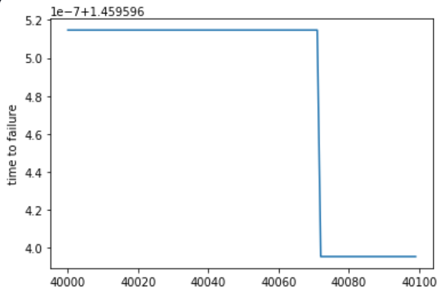

# Feature Engineering
Basically, our approach is to make as many features as possible and then give them all to the model to use! 
Later, we can perform **feature reduction** using the feature importances from the model or other techniques such as PCA.

### Usefulness 
To determine if the new variable is useful, we can calculate the **Pearson Correlation Coefficient** (r-value) between this variable and the target.
This measures the strength of a linear relationship between two variables and ranges from -1 (perfectly negatively linear) to +1 (perfectly positively linear). 

The r-value is **not best measure** of the "usefulness" of a new variable, but it can give a first approximation of whether a variable will be helpful to a machine learning model. 

Therefore, we look for the variables with the greatest **absolute** value r-value relative to the target.

We can also visually inspect a relationship with the target using the **Kernel Density Estimate**(KDE) plot.

### new_corrs = sorted(new_corrs, key = lambda x: abs(x[1]), reverse = True)
new_corrs 里面的元素是元祖，所以要设置排序的ｋｅｙ．这里的ｋｅｙ是元祖的第一个元素．

### The Multiple Comparisons Problem
 We can make hundreds of features, and some will turn out to be corelated with the target simply because of random noise in the data. Then, when our model trains, it may overfit to these variables because it thinks they have a relationship with the target in the training set, but this does not necessarily generalize to the test set. 
 这也许就是为什么我之前加入一个和频率相关的数据之后，验证集的分数反而下降了．
 
### 接下来用ＰＣＡ把数据搞一搞
 
### Feature Selection
We can also use the percentage of missing values to remove features with a substantial majority of values that are not present.

Feature selection will be an important focus going forward, because reducing the number of features can help the model learn during training and also generalize better to the testing data.

Feature selection is the process of removing variables to help our model to learn and **generalize better to the testing set**.

There are a number of tools we can use for this process, but in this notebook we will stick to removing columns with a high percentage of missing values and variables that have a high correlation with one another. Later we can look at using the feature importances returned from models such as the **Gradient Boosting Machine or Random Forest to perform feature selection.**

### 用shift window的方法，去创造，更多的样本．
#### Correlated 不等于有用
 However, just because the variable is correlated does not mean that it will be useful, and we have to remember that if we generate hundreds of new variables, some are going to be correlated with the target simply because of **random noise.**
 
 ### 去除相关性强的数据也许会导致分数下降
 Removing the highly collinear variables slightly decreases performance so we will want to consider a different method for feature selection. 
 Moreover, we can say that some of the features we built are among the most important as judged by the model.
### Automated Feature Engineering
Feature Tools,
**an open-source Python library for automatically creating features with relational data.**
Feature tools has the ability to do this for us, creating many new candidate features with minimal effort. These features are combined into a single table that can then be passed on to our model.

### 保持乐观，韧性，并且努力加油！

### Feature Tools
 The concept of Deep Feature Synthesis is to use basic building blocks known as feature primitives (like the transformations and aggregations done above) that can be stacked on top of each other to form new features. 
The depth of a "deep feature" is equal to the number of **stacked primitives**.

### deep feature synthesis
就是堆叠在一起，同我的wavelet深度堆积
### https://blog.csdn.net/Mlooker/article/details/80318601　

### 搜狗字母间隔异常问题解决方法
搜狗输入法的 全半角切换 选项 点一下即可.
### latex公式不能在markdown中直接被渲染(render).
但可以使用html语句.

### 一些高分者写的kernel
#### Simple Blend ( Blend: 融合）
分别用不同的模型生成预测结果，保存在不同的文件里面，然后再依次读入，然后设计权重相加．

### 接下来准备用一个LSTM - Autoencoder去提取特征．

### kernel 代码学习．

#### reshape(-1,1)
可以用于numpy库里的ndarray和array结构以及pandas库里面的DataFrame和Series结构。

在实际使用中，特别是在运用函数的时候，系统经常会提示是否需要对数据使用reshape(1,-1)或者reshape(-1,1)进行转换.

-1 --> unspecified value (1,-1)即为限定为一行,然后不管多少列.只要给我reshape成一行就ok了.

通配符: wildcard

#### Ordinary least squares Linear Regression. 

图片插入,先保存图片,然后书写: \!\ 
线性回归是指直线回归,非直线(曲线)不是线性哟~

#### STA/LTA 算法(长短视窗处理地震信号算法)
*这个我相信非常重要*  
震相自动识别是地震速报和地震预警中的重要工作之一.  
针对震相自动识别中最常使用的方法STA/LTA算法.  
能反映地震信号振幅和频率变化特征的特征函数:  

CF(i)=Y(i)2-Y(i-1)Y(i+1) 

(其中CF(i)为i时刻的特征函数,Y(i)为i时刻的地震信号振幅)

short time average over long time average

reject energetic transients: 拒绝能量瞬变
from ambient vibration recordings: 环境随机振动  

STA/LTA is the ratio between the amplitude, here computed as the L1 norm (average of the absolute values), of the signal on a short time window of length STA and on a long time window of length LTA.

seismic	英[ˈsaɪzmɪk]: 地震的 noise is relevant to any discipline that depends on seismology, such as geology, oil exploration, hydrology[haɪˈdrɒlədʒi]水文学, and earthquake engineering, and structural health monitoring.   

 It is often called ambient wavefield or ambient vibrations in those disciplines. (However, the latter term may also refer to vibrations transmitted through by air, building, or supporting structures.)

Seismic noise is a nuisance麻烦事; 讨厌的人(或东西); 妨害行为 for activities that are sensitive to vibrations, such as accurate measurements, precision milling, telescopes, and crystal growing.

### 别人也看过那篇论文: Machine Learning predicts laboratory earthquakes

seismic data 采样频率是330KHz, 即每秒330,000个数据点.

但是,kaggle里面的数据采样频率是4,000KHz, 预测输入是150,000个数据点,是0.0375s里面的数据.  

每个Bin之间有12 micorseconds 的间隔,即0.000012s的间隔,
这个占整个Bin长度(0.0375s)的0.00032(即0.032%). 不确定这个影响是否对最终预测会造成多大影响.

Each window is 1.8s, which is small
120 compared to the time between fault gouge failures (8s on average).

###  Pandas as pd 使用笔记
pd.read_cvs(path, dtype = {字典,分别assign每一列数据的类型.}, )

0~5000,000,这里差不多有33个bin.

对应的时间变化. 从1.4 到 0 . 在0.3的时候会出现一个脉冲.

5000,001~10,000,000,这里差不多33个bin.  
震荡区间在-150到200之间.

对应的时间变化,从12 逐渐到0 . 

1000个数据点的小片段

100个数据点的小片段,区间在-1 到 10 左右.

在100个数据点之内,有0.00000052s的时间变化,  
对应4MHz的频率的话有2.08个数据点的变化,这仅仅是比例上的对比.

marginally: 微弱地  
#### pd.Series
One-dimensional ndarray with axis labels (including time series).  
感觉和list差不多哦. 一维数列,但是带有索引index.  

### 比赛评价函数mean absolute  error.
所以1.46 是时间上的平均误差,1点多秒.

### 重大发现
sta_lta 过滤为高频部分的时候,拟合更好.

